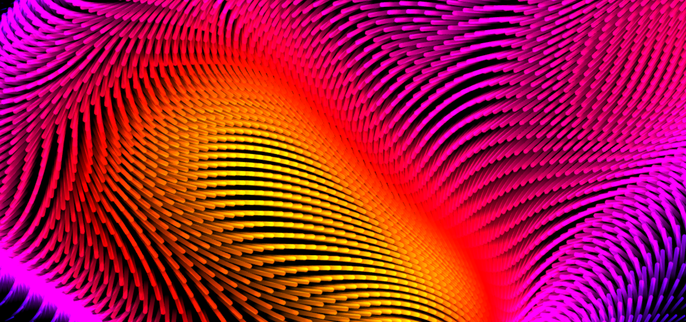

# Drift

Drift is a real-time particle experiment built with [PixiJS](https://pixijs.com/), inspired by the macOS Drift screensaver. Motion, noise, and color blend into a smooth visual experience rendered entirely in the browser.



## 🌐 Live Demo

[https://marclinder.github.io/drift](https://marclinder.github.io/drift)

## 🛠 Tech Stack

- [PixiJS 8](https://pixijs.com/)
- TypeScript
- Vite

## 🚀 Setup

```bash
npm install
npm run dev
```

## 🔧 Build for Production
```bash
npm run build
```

## 📄 License
MIT — feel free to use, remix, or extend.